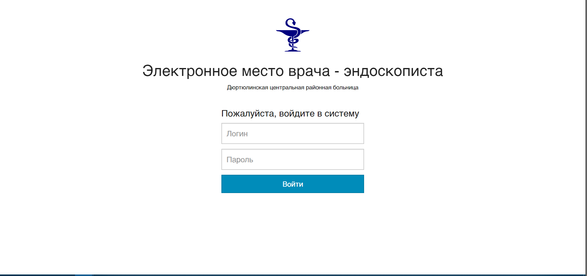
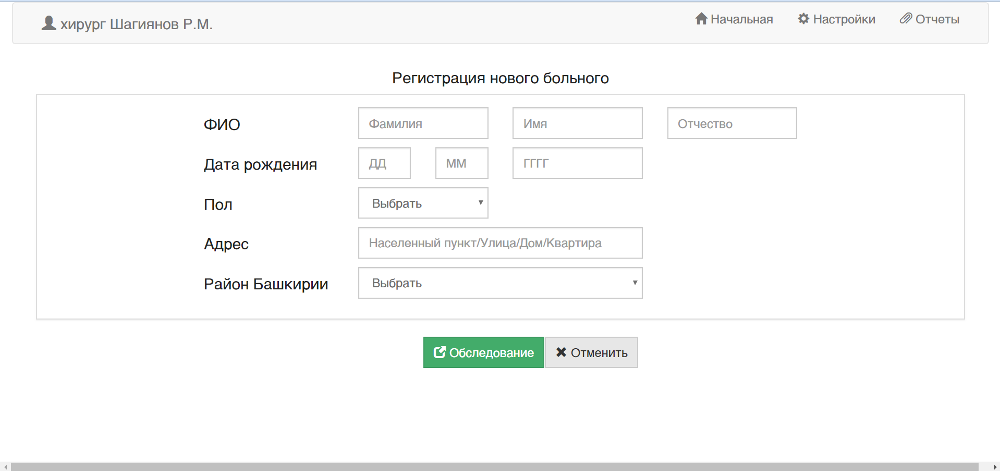

# EndoMRS
This project was aimed to create EMR (Electronic Medical Record) system for endoscopy. 
Was written on Java. Uses Hibernate, JSF with Bootstrap and Postgres SQL. As web server GlassFish was used.

At the moment the project in "to be continued" state.

## Some screenshots:

  
  

